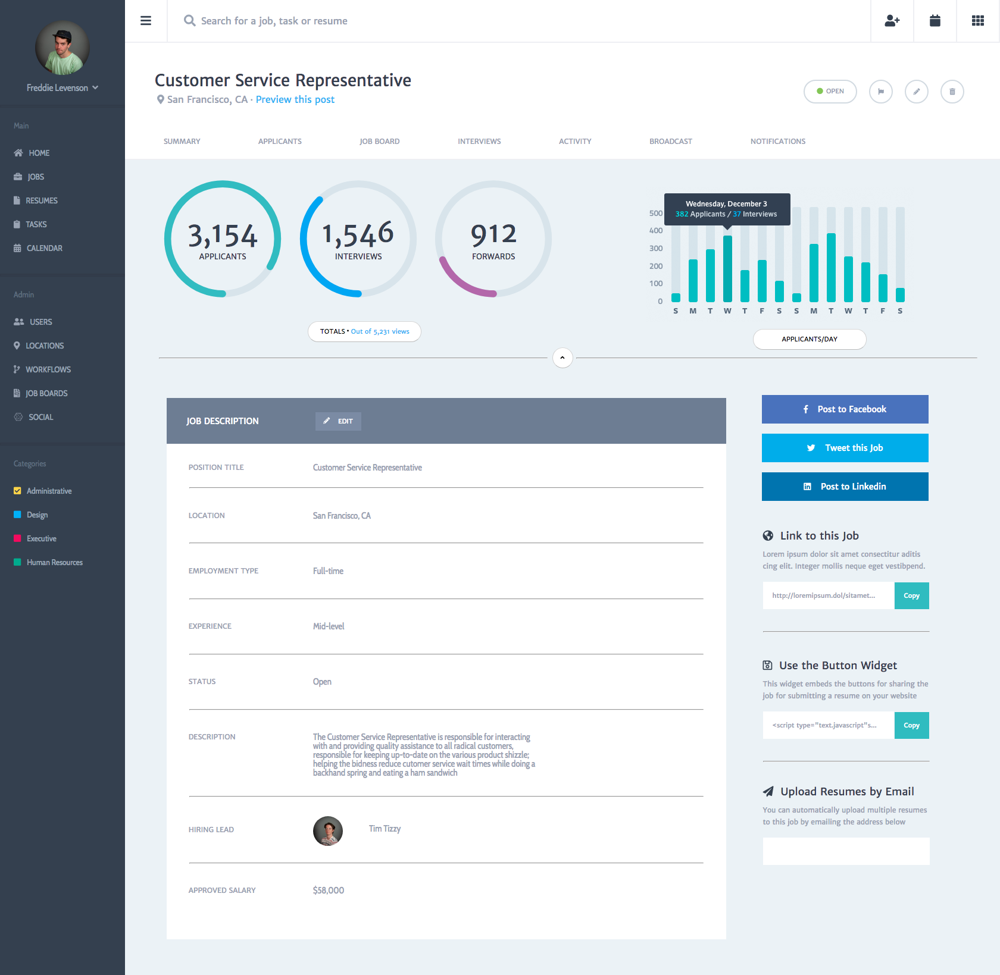

The purpose of this project was a test of our html and CSS competency by giving us an image of a web page that was fully laid out, and requiring us to replicate it to the best of our ability with semantic HTML and thoughtful CSS. It was also expected of us to create a responsive layout that would be usable on a smart phone or a tablet, and would not break down when the screen got smaller. Below are images of both the original image, and my completed project image.

